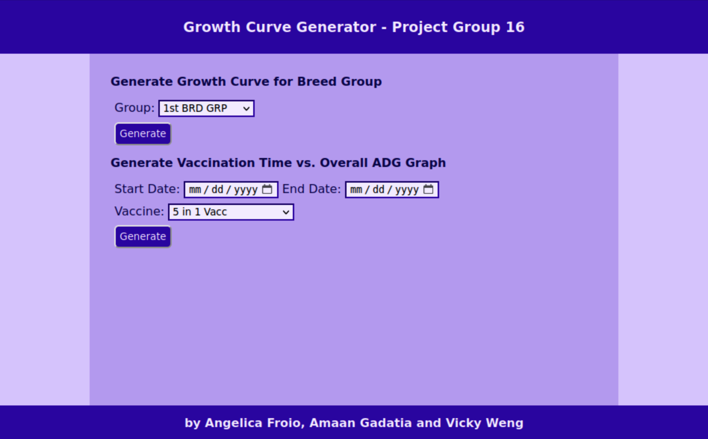
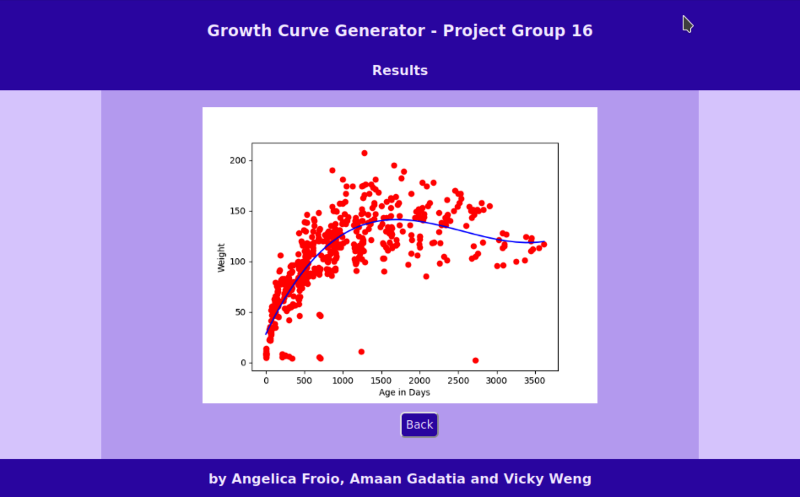
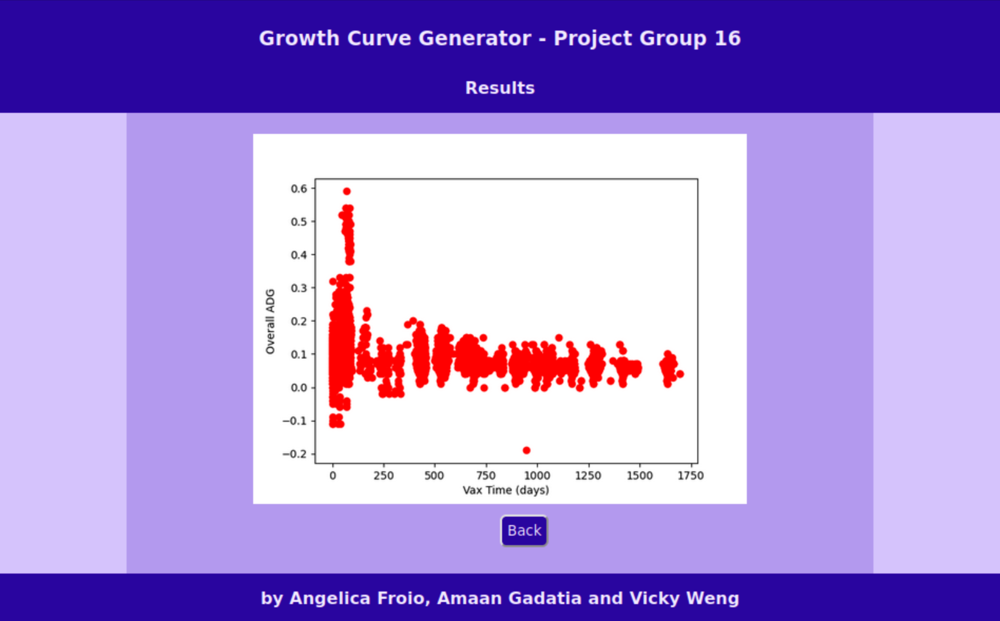

# Goat Database - Group 16
This repository houses our semester long group project for CSC 315: Database Systems. We are working with the Silvies Valley Ranch in Oregon, the developer of American Range Goats, to explore a proposed research topic involving their goats in relation to database systems: calculating a growth curve for their entire goat herd at any point in time. The goal of the database is to reflect how the overall herd is growing over time, starting from their births until they are sold. In other words, if a goat has a certain birth weight, how long does it take for them to reach a certain target weight and at what age does its growth slow down or stop?

In addition to the proposed research topic, we came up with a research topic of our own to explore as per the project requirements: Does the length between the date of birth and the date of vaccination for a goat have any impact on its growth rate and age when sold?

The ranch has kept track of all information related to their goats in their own database and shared with our class five tables that would be relevant to their proposed research topics. We converted their database tables into PostgreSQL tables for the purposes of our project, as was required for the class.

## Database Creation and Population instructions
*Step 1*: Clone this repository onto your local machine. Make sure that you have Postgres installed on your local machine too.

*Step 2*: Open a terminal window and navigate to the downloaded directory using the `cd` command appropriately. The name of the folder will be **project-group-16**.

*Step 3*: Create a new Postgres database using the `createdb` command, specifying a name for the database after the command.

*Step 4*: Start Postgres using the `psql` command followed by the name of the database you specified in Step 3.

*Step 5*: To create the database and populate the tables with the goat data, run the command `\i build_db.sql`. This SQL file creates five database tables named Animal, Note, Events,
          Activity, and Trait based on the provided CSV files Animal, Note, PicklistValue, SessionAnimalActivity, and SessionAnimalTrait respectively. Only certain columns are extracted
          per table except for the PicklistValue table, which has only three columns. This achieved through creating temporary tables for the five relations, copying the data from each
          CSV file into their respective temporary tables, and selecting only a certain set of columns from each temporary tables and inserting them into their respective base tables.
          In addition, we created three virtual tables that relate to the proposed research topic we explored: one that lists the weights for goats, one that lists the different types
          of vaccines given to goats, and one that lists the ages of the goats.
        

*Step 6 (optional)*: To run a few sample queries on the virtual tables mentioned in step 5, type `\i sample_queries.sql` and press enter.

## Flask Module Instructions
*Step 1*: This module uses several python packages to create graphs and perform linear regression. If you don't have them already installed, run these commands:

```
sudo pacman -Syu
sudo pacman -S python-matplotlib python-scikit-learn
```

*Step 2*: Run these commands to start serving the website locally:

```
export FLASK_APP=app.py
# only need to export once per terminal session
flask run
#browse to http://127.0.0.1:5000/
```
*Step 3*: Use the graph generator as desired.


## UI Images



